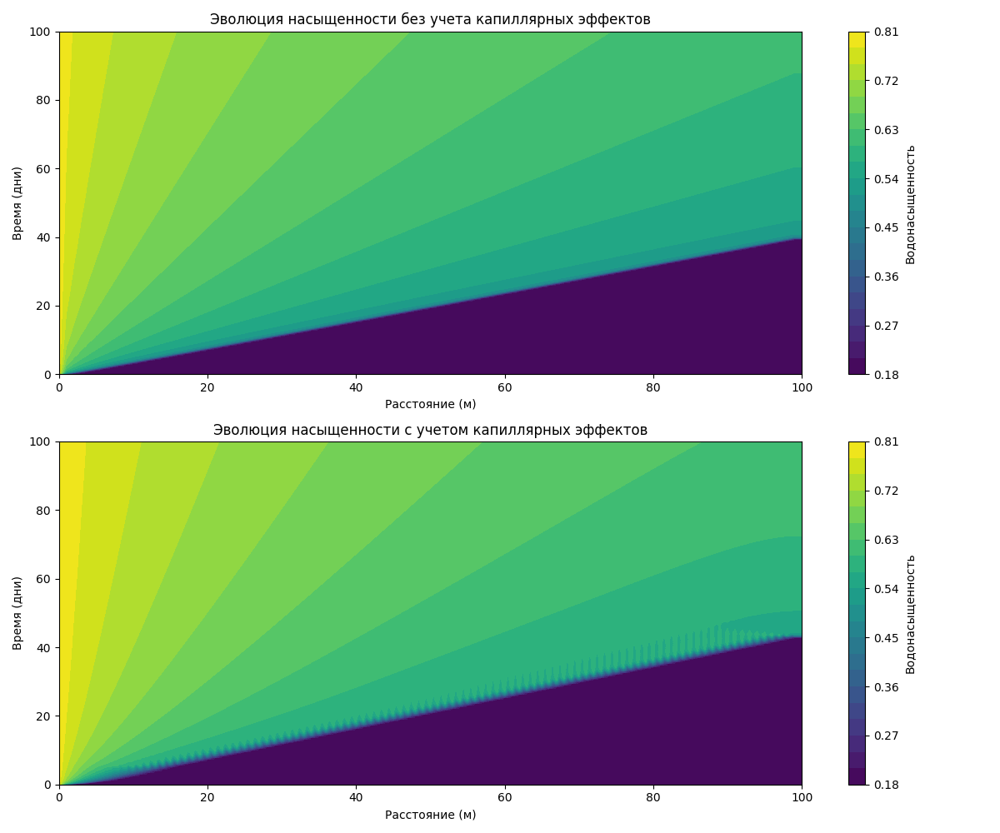

# Численное моделирование одномерной фильтрации нефти в пористой среде

## Описание проекта
Данный проект представляет собой численную модель одномерной фильтрации нефти в пористой среде с использованием метода апвинд. Модель позволяет анализировать влияние капиллярных эффектов на процесс вытеснения нефти водой.

## Параметры модели
- Длина пласта: 100.0 м
- Пористость: 0.2
- Вязкость нефти: 5.0 мПа·с
- Вязкость воды: 1.0 мПа·с
- Начальная водонасыщенность: 0.2
- Остаточная нефтенасыщенность: 0.2
- Количество узлов сетки: 100
- Временной шаг: 0.05 дней
- Общее время моделирования: 100 дней

## Результаты моделирования

### Профиль насыщенности (на 50-й день)
| Расстояние от входа (м) | Насыщенность воды (без кап. эффектов) | Насыщенность воды (с кап. эффектами) |
|-------------------------|--------------------------------------|-------------------------------------|
| 0.0                     | 0.80                                 | 0.80                                |
| 10.0                    | 0.71                                 | 0.73                                |
| 20.0                    | 0.67                                 | 0.69                                |
| 30.0                    | 0.64                                 | 0.66                                |
| 40.0                    | 0.62                                 | 0.64                                |
| 50.0                    | 0.61                                 | 0.62                                |
| 60.0                    | 0.59                                 | 0.61                                |
| 70.0                    | 0.58                                 | 0.60                                |
| 80.0                    | 0.57                                 | 0.58                                |
| 90.0                    | 0.56                                 | 0.57                                |
| 100.0                   | 0.55                                 | 0.57                                |

### Коэффициент нефтеотдачи
| Время (дни) | Коэффициент нефтеотдачи (без кап. эффектов) | Коэффициент нефтеотдачи (с кап. эффектами) |
|-------------|---------------------------------------------|-------------------------------------------|
| 10          | 0.13                                        | 0.13                                      |
| 30          | 0.38                                        | 0.37                                      |
| 50          | 0.53                                        | 0.55                                      |
| 70          | 0.56                                        | 0.58                                      |
| 100         | 0.59                                        | 0.60                                      |

### Параметры фронта вытеснения
| Параметр                          | Без капиллярных эффектов | С капиллярными эффектами |
|-----------------------------------|--------------------------|--------------------------|
| Время прорыва воды (дни)          | 39.5                     | 43.0                     |
| Скорость движения фронта (м/день) | 2.53                     | 2.33                     |
| Ширина переходной зоны (м)        | 2.0                      | 25.0                     |

### Распределение давления (на 50-й день)
| Расстояние от входа (м) | Давление без кап. эффектов (МПа) | Давление с кап. эффектами (МПа) |
|-------------------------|----------------------------------|--------------------------------|
| 0.0                     | 10.0                             | 10.0                           |
| 20.0                    | 9.6                              | 9.7                            |
| 40.0                    | 9.2                              | 9.4                            |
| 60.0                    | 8.8                              | 9.0                            |
| 80.0                    | 8.4                              | 8.5                            |
| 100.0                   | 8.0                              | 8.0                            |

## Визуализация результатов

### Профили насыщенности

### Коэффициент нефтеотдачи

### Эволюция насыщенности

### 3D поверхность насыщенности

### Разница в насыщенности

### Капиллярное число

## Выводы
Результаты моделирования показывают значительное влияние капиллярных эффектов на процесс вытеснения нефти водой:
1. Капиллярные эффекты замедляют движение фронта вытеснения (скорость снижается с 2.53 до 2.33 м/день)
2. Время прорыва воды увеличивается с 39.5 до 43.0 дней
3. Ширина переходной зоны существенно увеличивается с 2.0 до 25.0 м
4. Коэффициент нефтеотдачи в конечном итоге выше при учете капиллярных эффектов (0.60 против 0.59)
5. Профиль давления более пологий при учете капиллярных эффектов